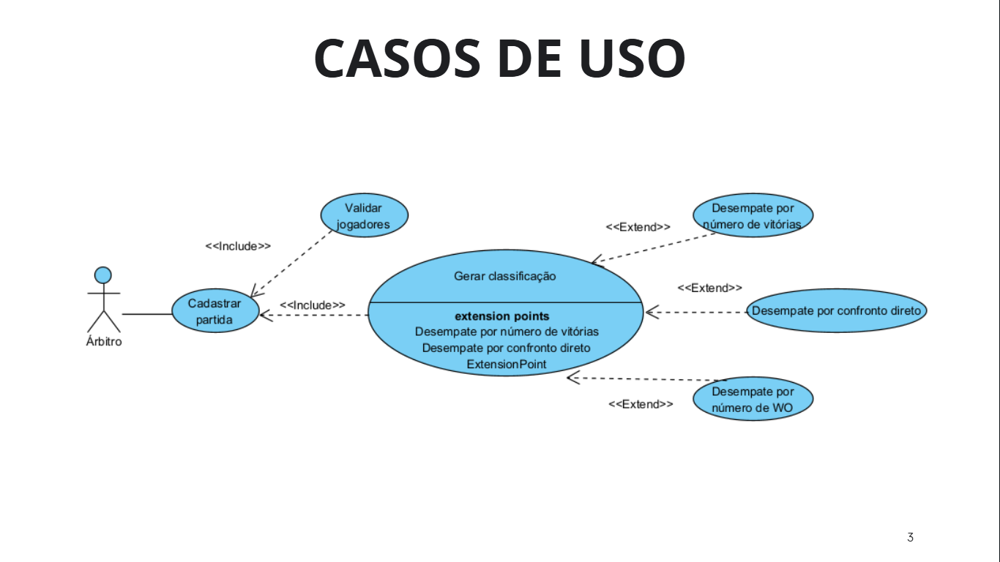
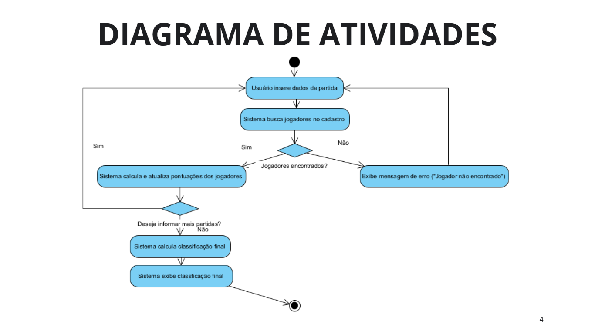

# Classificador de Torneios de Xadrez: Algoritmo para o Sistema Suíço

## 🎯 Sobre o Projeto

Este projeto consiste em um script Python de linha de comando. Ele foi desenvolvido como parte de um Projeto de Extensão da UDESC (Engenharia de Software). O foco principal foi aplicar algoritmos de classificação para o Sistema Suíço em torneios de xadrez.

O script foi utilizado no Torneio de Xadrez Intersalas da escola EEB Gertrud Aichinger. O objetivo era oferecer uma solução funcional e eficiente para classificar torneios no formato Suíço, garantindo economia de tempo e precisão na apuração dos resultados.

## ✨ Funcionalidades

O `main.py` oferece as seguintes capacidades:

* **Entrada Interativa de Partidas:** Insira dados de partidas (jogadores, resultado, W.O.) diretamente no terminal.
* **Cálculo de Pontuação Padrão:**
    * Vitória: 1 ponto
    * Empate: 0.5 ponto
    * Derrota: 0 pontos
* **Gestão de Dados do Jogador:** O sistema atualiza automaticamente estatísticas como:
    * Pontuação Total
    * Número de Vitórias
    * Registro de Vitórias por Confronto Direto
    * Contagem de Vitórias por W.O.
* **Algoritmo de Classificação e Desempate (Sistema Suíço):** A classificação final segue esta ordem de critérios:
    1.  **Pontuação Total**
    2.  **Confronto Direto**
    3.  **Número de Vitórias**
    4.  **Vitórias por W.O.:** O jogador com menor número de vitórias por W.O. tem precedência.
* **Resultado da Classificação:** Exibe a tabela final no console, mostrando posição, nome, pontos e vitórias.

## 🛠️ Tecnologias Utilizadas

* Python 3.x (desenvolvido com Python 3.8+)

## 🚀 Como Usar

Siga os passos para rodar o script:

### Pré-requisitos

Tenha o Python 3.x instalado. Baixe em [python.org](https://www.python.org/).

### Instalação

1.  Clone o Repositório:
    ```bash
    git clone https://github.com/gabrielfusinato/classificador-torneios-xadrez
    cd classificador-torneios-xadrez
    ```

### Executando o Script

1.  Abra o terminal na pasta do projeto.
2.  Execute:
    ```bash
    python main.py
    ```
3.  O script pedirá as informações de cada partida interativamente:
    * `Digite o nome do jogador de brancas (ou tecle 'X' para sair):`
    * `Digite o nome do jogador de pretas:`
    * `Resultado (w para brancas, b para pretas, d para empate):`
    * `Foi WO? (S para sim, N para não):` (Só se for vitória/derrota)
4.  Para finalizar a entrada de partidas, digite `X` (maiúsculo ou minúsculo) quando o script pedir o nome do jogador de brancas.

## 📂 Estrutura do Projeto

```
.
├── main.py                # Lógica principal do script.
├── README.md              # Este arquivo.
├── diagrams/useCase.png   # Diagrama de Casos de Uso.
└── diagrams/activity.png  # Diagrama de Atividades.
```

## 📝 Documentação Formal do Projeto

Como parte do projeto de extensão, foram desenvolvidos documentos formais de Engenharia de Software:

* **Diagrama de Casos de Uso:** Ilustra as interações do usuário (Árbitro) com o sistema e as funcionalidades.


* **Diagrama de Atividades:** Detalha o fluxo operacional do sistema, da inserção de dados à exibição da classificação.


## 📧 Contato

* **Acadêmico:** Gabriel Fusinato
    * [LinkedIn](https://www.linkedin.com/in/gabriel-fusinato/)
    * [GitHub](https://github.com/gabrielfusinato)
* **Professor Orientador:** Leandro Loffi